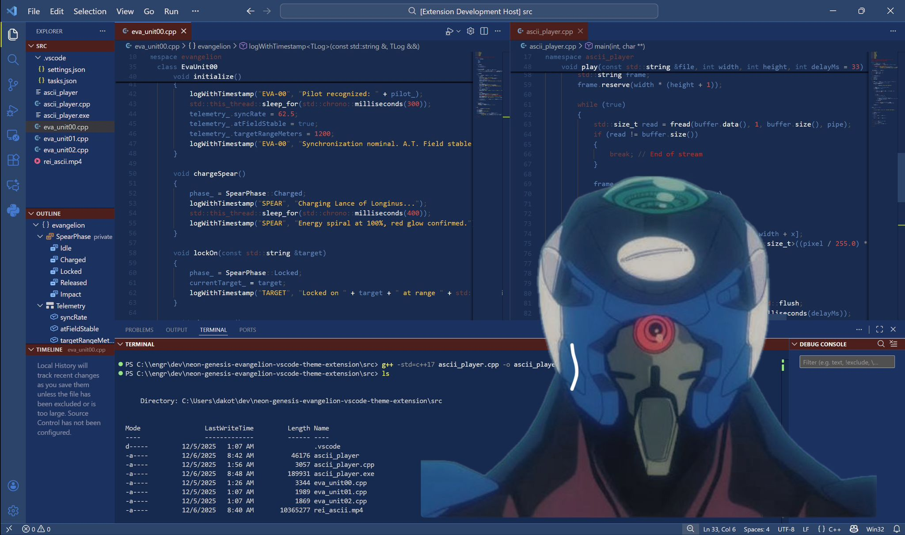

# Neon Genesis Evangelion Themes

The current release and proposed quality-release direction are documented in [Project direction](docs/project-direction.md).

## EVA Unit-00 💙🖤

Code with the intensity and focus of [Rei Ayanami](https://youtu.be/ybIOYGSooPg?si=1itpdKV7T-8WDXG2) with the EVA Unit-00 (エヴァンゲリオン 零号機) color theme

## EVA Unit-01 Berserk 💜💚

Develop in [BERSERK MODE](https://www.youtube.com/watch?v=-olPXm8oJyw) with the EVA Unit-01 (エヴァンゲリオン初号機) color theme

## EVA Unit-02 ❤️‍🔥

Honor the [death of Asuka and Unit 02](https://www.youtube.com/watch?v=OO-1Yyi5KPY) with the EVA Unit-02 (エヴァンゲリオン弐号機) color theme

## Installation
1. Install and launch [Visual Studio Code](https://code.visualstudio.com/)
2. *Settings* > *Extensions* (or `Ctrl+Shift+X`)
3. Search for `Neon Genesis Evangelion Themes`
4. Click *Install*
5. *Settings* > *Themes* > *Color Theme* >  `EVA Unit-00` \ `EVA Unit-01 Berserk` \ `EVA Unit-02`

## Issues & Feedback
 
 Suggest changes and fixes on the repository [issues](https://github.com/engrx0/neon-genesis-evangelion-vscode-theme-extension/issues) page or reach out directly via any platform listed on my github profile. 

 Leave a review on the VS Code theme extension page `^_^`

[change log](https://github.com/engrx0/neon-genesis-evangelion-vscode-theme-extension/blob/main/CHANGELOG.md)

## License

This project is licensed under the [MIT License](LICENSE)
